# High-Performance URL Shortener

> **Zero-Collision, Cryptographically Obfuscated URL Shortening Service**  

## Overview

A robust, production-ready URL shortener API that converts long URLs into short, web-safe links. The system is designed with a focus on security, high throughput, and cryptographic non-predictability.

---

## System Design & Architecture

Unlike traditional URL shorteners that generate random strings and handle database collisions via expensive retry loops, this service uses a mathematically guaranteed, zero-collision pipeline.

```mermaid
graph TD
    subgraph Write Path
        A[Long URL Input] --> B[Validate & Protect SSRF]
        B --> C[Insert to DB & Get Sequential ID]
        C --> D[4-Round Feistel Cipher Obfuscation]
        D --> E[Base62 Encoding]
        E --> F[Pre-warm Redis Cache]
        F --> G[Short URL Output]
    end

    subgraph Read Path
        H[GET /code] --> I[Redis Cache Look-up]
        I -- Cache Hit --> J[302 Redirect]
        I -- Cache Miss --> SF[Singleflight Coalescing]
        SF --> K[DB Read Query]
        K --> L[Populate Redis Cache]
        L --> J
    end
```



### 1. Zero-Collision ID Obfuscation
* **Sequential Database IDs**: When a long URL is shortened, PostgreSQL allocates a unique, auto-incrementing 64-bit integer (`bigint`).
* **Cryptographic Feistel Cipher**: To prevent URL enumeration and scanning attacks, the sequential ID is run through a **4-Round Feistel Cipher** using a private 32-bit seed.
* **Bijective Guarantee**: Because a Feistel cipher is mathematically bijective (a one-to-one mapping), it guarantees **zero collisions** across the entire 64-bit space. There is no need for retry loops or check-and-insert overhead.

### 2. Base62 Web-Safe Encoding
* The obfuscated 64-bit ID is converted into a base-62 string using the character set `[a-zA-Z0-9]`. This results in highly compact short codes of up to 11 characters.

### 3. Server-Side Request Forgery (SSRF) Protection
* The web handlers validate incoming hosts prior to shortening. Loopback addresses, private networks, and internal DNS names (such as `localhost` or `192.168.x.x`) are automatically blocked to secure your internal infrastructure.

### 4. Cache Stampede Protection (Singleflight Pattern)
* To defend the database against the **Thundering Herd** problem under peak traffic, the database fallback loader is wrapped in a `singleflight.Group`.
* If a popular short link expires or experiences a cache miss, only **one concurrent request** is dispatched to PostgreSQL to resolve the destination. All other parallel lookup threads block and share the single result dynamically, protecting database connection pools and preventing database CPU spikes.

### 5. High-Performance Redis Caching (Decorator Pattern)
* To achieve sub-millisecond redirect read response times, a repository decorator pattern wraps the database access.
* **Pre-warming on Create**: Newly created URL entries are immediately pre-warmed into Redis.
* **Dynamic Expire Synchronization**: Cache lifetimes (TTLs) are aligned dynamically to the precise database `ExpiresAt` value.
* **Pass-through Fallback**: If a cache miss occurs, the Postgres repository handles the lookup and backfills Redis.

### 6. Distributed Rate Limiting (TxPipeline)
* To protect the service from abuse in a distributed cluster, rate limiting is handled by a polymorphic middleware.
* The Redis implementation executes a pipelined transaction (`TxPipeline`) to perform atomic increments and expiration sets in a single round-trip, minimizing latency and connection overhead.

### 7. SRE Connection Pooling & Timeout Tuning
* To guarantee stable latencies under load, Redis connectivity is tuned with strict production-grade parameters:
  * **Pool Sizing**: Idle bounds (`REDIS_MIN_IDLE_CONNS`) and max size limits (`REDIS_POOL_SIZE`) are set dynamically via the environment.
  * **Network Timeouts**: Precise configurations for Dial (`REDIS_DIAL_TIMEOUT`), Read (`REDIS_READ_TIMEOUT`), and Write (`REDIS_WRITE_TIMEOUT`) network states eliminate thread starvation and fast-fail unresponsive network sockets.

### 8. Composite Health Checking
* The `/health` endpoint performs asynchronous, concurrent pings to both PostgreSQL and Redis databases. If either component fails to reply within the timeout threshold, a detailed status response is returned alongside a `503 Service Unavailable` status code to allow automated load balancers to isolate degraded app instances instantly.

### 9. DevOps Memory Isolation
* The containerized Redis setup is configured inside `docker-compose.yml` with strict runtime limits:
  * **Memory Limits**: Max memory capped to `256mb` (configurable via `REDIS_MAX_MEMORY`) to prevent host memory exhaustion and container termination.
  * **Eviction Policy**: Configured with `allkeys-lru` (least-recently-used) memory eviction to dynamically drop older entries and prevent system halts under extreme cache pressure.

---

## Technology Stack

* **Language**: Go 1.22+
* **Router**: Go Chi v5 (Lightweight, idiomatic routing)
* **Database**: PostgreSQL 17 (With robust database connection pooling)
* **Caching & Rate Limiting**: Redis 7.4 (With SRE timeout controls and transaction-safe pipelines)
* **Environment Configuration**: Go-dotenv (Recursive parent-directory resolution)

---

## Quick Start

### 1. Clone & Setup Environment
Copy the example environment configuration:
```bash
cp .example.env .env
```

### 2. Start PostgreSQL and Redis
Run the Docker Compose stack:
```bash
docker compose up -d
```

### 3. Start the API Server
```bash
go run cmd/api/main.go
```
The server will automatically apply pending schema migrations, connect to Redis, and listen on port `8080`.

---

## API Endpoints

### 1. Shorten URL
* **URL**: `POST /shorten`
* **Request**:
```json
{
  "original_url": "https://news.ycombinator.com"
}
```
* **Response**:
```json
{
  "short_url": "http://localhost:8080/c8Z7bY3p",
  "short_code": "c8Z7bY3p"
}
```

### 2. Redirect URL
* **URL**: `GET /{code}`
* **Response**: `302 Found` (Redirects to original destination)

### 3. Health Check
* **URL**: `GET /health`
* **Response**: `200 OK` (or `503 Service Unavailable` if degraded)
```json
{
  "status": "healthy",
  "components": {
    "database": "up",
    "redis": "up"
  }
}
```
