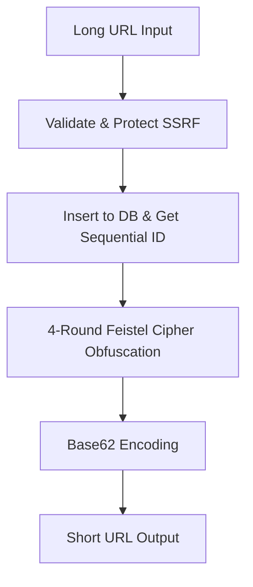

# High-Performance URL Shortener

> **Zero-Collision, Cryptographically Obfuscated URL Shortening Service**  

## Overview

A robust, production-ready URL shortener API that converts long URLs into short, web-safe links. The system is designed with a focus on security, high throughput, and cryptographic non-predictability.

## System Design & Architecture

Unlike traditional URL shorteners that generate random strings and handle database collisions via expensive retry loops, this service uses a mathematically guaranteed, zero-collision pipeline.



### 1. Zero-Collision ID Obfuscation
* **Sequential Database IDs**: When a long URL is shortened, PostgreSQL allocates a unique, auto-incrementing 64-bit integer (`bigint`).
* **Cryptographic Feistel Cipher**: To prevent URL enumeration and scanning attacks, the sequential ID is run through a **4-Round Feistel Cipher** using a private 32-bit seed.
* **Bijective Guarantee**: Because a Feistel cipher is mathematically bijective (a one-to-one mapping), it guarantees **zero collisions** across the entire 64-bit space. There is no need for retry loops or check-and-insert overhead.

### 2. Base62 Web-Safe Encoding
* The obfuscated 64-bit ID is converted into a base-62 string using the character set `[a-zA-Z0-9]`. This results in highly compact short codes of up to 11 characters.

### 3. Server-Side Request Forgery (SSRF) Protection
* The web handlers validate incoming hosts prior to shortening. Loopback addresses, private networks, and internal DNS names (such as `localhost` or `192.168.x.x`) are automatically blocked to secure your internal infrastructure.

### 4. IP-Based Token Bucket Rate Limiting
* To protect the service from abuse, a custom in-memory token bucket rate limiter throttles traffic. Read and write limits are isolated per client IP to ensure search spiders cannot starve resource creation.

### 5. Automated SRE Cleanup
* An asynchronous background worker executes periodically to purge expired URLs from the database, maintaining database index performance.

---

## Technology Stack

* **Language**: Go 1.22+
* **Router**: Go Chi v5 (Lightweight, idiomatic routing)
* **Database**: PostgreSQL 17 (With robust database connection pooling)
* **Environment Configuration**: Go-dotenv (Recursive parent-directory resolution)

---

## Quick Start

### 1. Clone & Setup Environment
Copy the example environment configuration:
```bash
cp .example.env .env
```

### 2. Start PostgreSQL
Run the database service:
```bash
docker compose up -d
```

### 3. Start the API Server
```bash
go run cmd/api/main.go
```
The server will automatically apply pending schema migrations and listen on port `8080`.

---

## API Endpoints

### 1. Shorten URL
* **URL**: `POST /shorten`
* **Request**:
```json
{
  "original_url": "https://news.ycombinator.com"
}
```
* **Response**:
```json
{
  "short_url": "http://localhost:8080/c8Z7bY3p",
  "short_code": "c8Z7bY3p"
}
```

### 2. Redirect URL
* **URL**: `GET /{code}`
* **Response**: `302 Found` (Redirects to original destination)

### 3. Health Check
* **URL**: `GET /health`
* **Response**:
```json
{
  "status": "healthy"
}
```
